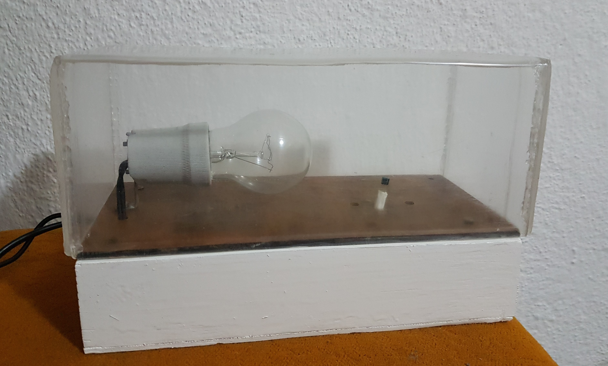
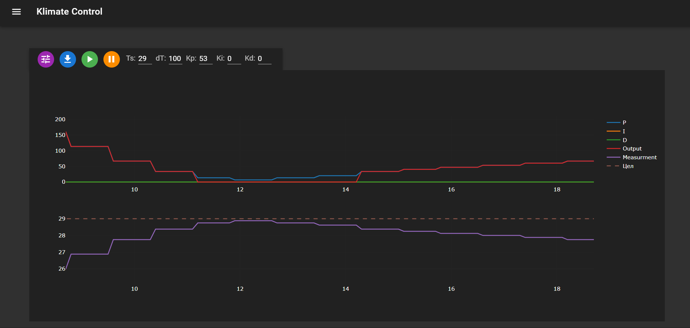

<div id="top"></div>

<!-- PROJECT LOGO -->
<br />
<div align="center">
  <a href="https://feit.ukim.edu.mk/en/">
    
  </a>

  <h3 align="center">Climate control</h3>

  <p align="center">
    Web interface with PID and Bang-Bang controlers 
    <br />
   
  </p>
</div>


<!-- TABLE OF CONTENTS -->
<details>
  <summary>Table of Contents</summary>
  <ol>
    <li>
      <a href="#about-the-project">About The Project</a>
      <ul>
        <li><a href="#built-with">Built With</a></li>
      </ul>
    </li>
    <li>
      <a href="#getting-started">Getting Started</a>
      <ul>
        <li><a href="#prerequisites">Prerequisites</a></li>
        <li><a href="#installation">Installation</a></li>
      </ul>
    </li>
    <li>
      <a href="#usage">Usage</a>
      <ul>
        <li><a href="#frontend">Frontend</a></li>
        <li><a href="#backend">Backend</a></li>
      </ul>
    </li>
    <li><a href="#license">License</a></li>
    <li><a href="#contact">Contact</a></li>
  </ol>
</details>


<!-- ABOUT THE PROJECT -->
## About The Project



We are simulating a closed insulated space where we control the temperature with a lamp as the heater. The temperature is measured with a DS18B20 sensor and the lamp is controlled by a solid state relay. Mcu of choice for this project is ESP-32 and everything is controlled and monitored throughout a web app on it.

The toolbar consists of buttons, fields and sliders to configure the controller:
* You can switch between the two controllers PID and Bang-Bang
* Download the data from the plot below into CSV format
* Pause and Resume the controllers 
* Ts is the target temperature 
* dT is a time delay between calculations
* Kp, Ki, Kd are the PID constants

All the data from the ESP-32 is sent to the website and ploted in two subplots with plotly:
* Plots P, I, D terms and the final output that controls the duty cycle of the lamp 
* Plots the target and current temperature

### Built With

* [ESP-IDF](https://github.com/espressif/esp-idf)
* [Vue.js](https://vuejs.org/)
* [Vuetify.js](https://vuetifyjs.com/en/)
* [Plotly](https://plotly.com/)

<!-- GETTING STARTED -->
## Getting Started

### Prerequisites

For the hardware side i have a 3d design on [thinker-cad](https://www.tinkercad.com/things/4Gmwou4LzL9) with all the 
parts listed below
* [ESP-32 MCU, for my project i used WROOM-32D](https://www.espressif.com/en/products/socs/esp32)
* [Solid state relay module](https://www.aliexpress.com/item/1005001621690700.html?spm=a2g0o.9042311.0.0.6e524c4dj7FvjA)
* [Tempreature sensor DS18B20](https://datasheets.maximintegrated.com/en/ds/DS18B20.pdf)
* Lamp or a heating element

For the software side you need to install and setup
* [Npm](https://www.npmjs.com/)
* [Vscode](https://code.visualstudio.com/)
* [Esp-idf extension for vscode](https://www.youtube.com/watch?v=Lc6ausiKvQM&t=83s&ab_channel=EspressifSystems)

### Installation

1. Clone the repo
   ```sh
   git clone https://github.com/vasetrendafilov/clima.git
   ```
2. Install NPM packages in subdirectory `front/web-demo`
   ```sh
   npm install
   ```
3. Build web app
   ```js
   npm run build
   ```
4. Open `Configuration Editor` from the bottom menu in vscode project, select `Example Connection Configuration` and enter wifi ssid and password 
5. Chose `Build, Flash and Monitor` to upload the program on the esp-32
6. For the solid state relay connect DC+ and DC- to 5v and any gnd pin on the ESP-32 and CH1( low trigger) to pin 27 
7. For the DS18B20 sensor connect pin 3 and 1 to 3.3v and gnd and the middle one to pin 21

<!-- USAGE EXAMPLES -->
## Usage

### Frontend 

The website core is built with `vue.js`, every package that is used is in `package.json`. In `main.js` we create the main vue object with the appropriate router, store and renderer. For the renderer we use vuetify to help with the html and css. With the router there are two paths home and control and the components are stored in `views` folder.

`App.vue` is the base html for all the views and it consists of:
* Navigation drawer to navigate trough all the paths for the website 
* Top toolbar to display the name and navigation toggle 
* Bottom footer 
* Fluid container to display all the router views

`Home.vue` is a basic card to display esp version and cores, the info is dynamically loaded with ajax. When the page is mounted on the website, there is an api call with a uri that is sent to the ESP-32 and waits for the data do be returned and store it on the website.

`Control.vue` consists of a to0lbar to tune the parameters and change controllers and two plots using plotly library to monitor live data that is sent from the ESP-32. Every input on the toolbar is limited with min and max values and can be set accordingly in the code. When the website is mounted we make an ajax call to return the default parameters and target that are in the esp-32 and make the plot with the layout and configuration. All the methods of the component are:
* update_parameters: takes the new parameters from the website and sends them to the mcu it is trigerd by hitting enter on any input
* change_controller: toggles between PID and bang-bang, sends it to the esp-32 and uptades the plot for the separate data 
* show_slider / hide_slider: animates in a hidden slider in the Kp, Ki, Kd inputs when the mouse is over them
* clima_resume: starts the controller, empties the plot and starts two interval timers to update the plot data and disply it 
* clima_pause: sends message to stop the controller and also clears the timers
* updateData: sends api calls every 700ms to get batch updates from the mcu parses the data and stores it in a pending trace 
* live_plot: plots new points every 700/dT ms while the pending trace is empty

### Backend

Hierarchical structure of the esp-idf contains:
* `.vscode` is a folder with the setting for esp-idf extension 
* `components` or libraries that we use in the main program and detailed explanation can be found in the docstring
* `main` consist of two main c files and `Kconfig` that is used to configure the project
* `sdkconfig` is the file where the configuration of the project is stored 
* `partitions.cvs` we use custom partition to store the main program and website

The main executable file is `esp_rest_main.c` where we initialize the nvs and mdns. Using the example_connect library we connect to the wifi with the ssid and password entered in the configuration editor, next we mount the web partition from sdcard or eeprom depending on the configuration. Last we call `start_rest_server(CONFIG_EXAMPLE_WEB_MOUNT_POINT)` from `rest_server.c` to start the rest server with the mount point.

With the `start_rest_server` function, we regirster all the uri hadlers to communicate with the website. Frstly, we include frertos libraries task and queue, ledc driver to control pwm output, ds18b20 lib to communicate with the sensor and PID. The next couple of lines are all the main variables for the pid, pwm configuration, sens and control task and queue to store the struct data below. All the uri handelers are:
* clima_init_get_handler: configuring the pwm, creating a queue of 20 items of type Data_t and creating two tasks that have the same priority and are running on core 1, with the controlhandle we can suspend and resume the tasks. In the end we send a response to the website with the default parameters
* clima_update_parameters_post_handler: its a little bit complex to recive data, but athe the end the bufer i parsed into a cJson object and we update the parameters of the pid with `PID_SetTuningParams` and `PID_SetTraget`
* clima_resume_get_handler: reset the queue to remove previous data, resume the control task and reset integral error of the PID
* clima_pause_get_handler: just suspends the control task
* clima_data_get_handler: we are receiving all the elements in the queue, transforming the data into a string and sending it back as a response to the website
* control_task: we declare temporary struct to hold the data and go into an infinite loop, depending on the controller:
  * Bang-Bang is a simple controller that turns the lamp on all the time by setting the duty to 0% until the current temperature is above the target, last we log the timestamp and measurement from the temperature sensor
  * PID is more complex and we use `PID_Update` to calculate the duty cycle, last we log also the PID terms

  At the end of the while loop, we send the temporary data to the queue and delay the task 

* sens_temp_task: we initialize the sensor and set the resolution, in the infinite loop we request and wait for a new reading, store it in a temporary variable and if it does not give an error we store the temperature in a global variable to be accessed by the control task
  
<!-- LICENSE -->
## License

Distributed under the MIT License. See `LICENSE.txt` for more information.


<!-- CONTACT -->
## Contact

Vase Trendafilov - [@TrendafilovVase](https://twitter.com/TrendafilovVase) - vasetrendafilov@gmail.com

Project Link: [https://github.com/vasetrendafilov/clima](https://github.com/vasetrendafilov/clima)

<p align="right">(<a href="#top">back to top</a>)</p>